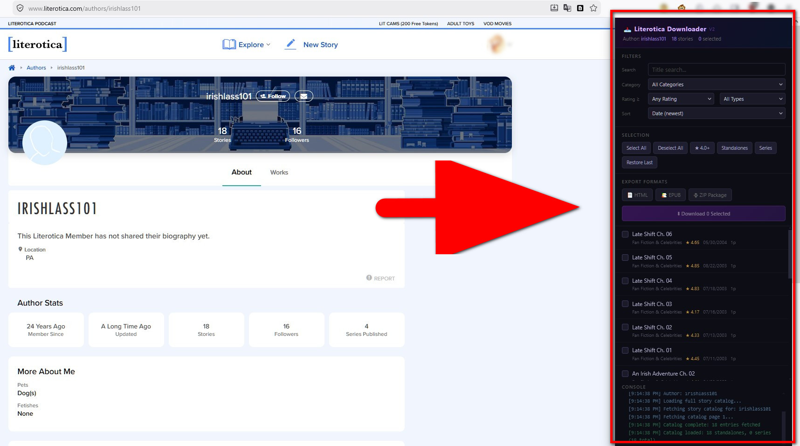
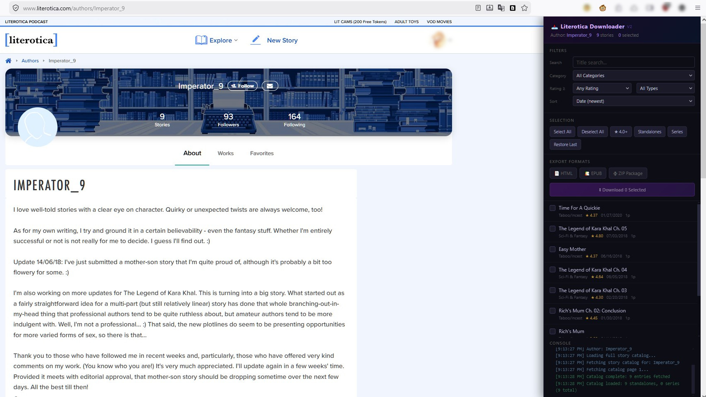
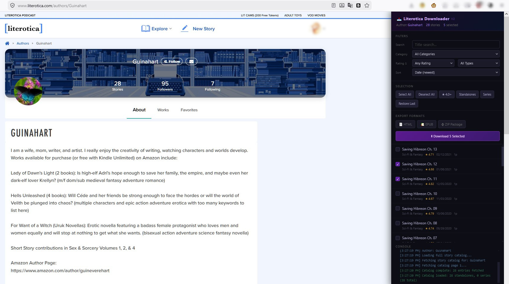

# Literotica Downloader V2

Public release repository for Literotica Downloader V2.

## Current releases
- Firefox + Greasemonkey: `2.1.30`
- Chrome + Tampermonkey: `2.1.31`

## Install
- Firefox + Greasemonkey listing: https://sleazyfork.org/en/scripts/577945-literotica-downloader-v2
- Firefox + Greasemonkey package: `dist/literotica-downloader-firefox-greasemonkey.user.js`
- Chrome + Tampermonkey package: `dist/literotica-downloader-chrome-tampermonkey.user.js`
- Maintained Firefox package copy: `userscript/literotica-downloader-firefox-greasemonkey.user.js`
- Maintained Chrome package copy: `userscript/literotica-downloader-chrome-tampermonkey.user.js`

## What it does
- Adds a downloader panel to Literotica author pages and member story listing pages.
- Loads an author's catalog so you can search, filter, sort, and select stories.
- Exports selected stories as `HTML`, `EPUB`, `TXT`, or `ZIP Package`.
- Supports `Combined Files` and `Separate Chapters`.
- Continues the batch when individual stories fail.
- Keeps the panel usable on smaller windows with a compact-height layout.

## Screenshots
Main panel view:

Selection and export examples:

## Supported browsers
- Firefox + Greasemonkey
- Chrome + Tampermonkey

## Release metadata
- Firefox release metadata stays with the Firefox + Greasemonkey package and listing.
- Chrome release metadata stays with the Chrome + Tampermonkey package for separate submission.

## Basic usage
1. Open a Literotica author page or member story listing page.
2. Wait for the downloader panel to load the catalog.
3. Filter, sort, and select the stories you want.
4. Choose your export format and file structure.
5. Click `Download`.

## Notes
- Download speed depends on story size, page count, and network conditions.
- Private or deleted stories may fail and will be skipped without stopping the rest of the batch.
- This script is for personal-use downloading and organization. It does not bypass paywalls.

## Release docs
- Changelog: [CHANGELOG.md](D:\Desktop\literotica-author-library-downloader\CHANGELOG.md)
- Submission notes: [SLEAZYFORK_SUBMISSION.md](D:\Desktop\literotica-author-library-downloader\SLEAZYFORK_SUBMISSION.md)

## Support
- Homepage: https://studios.easyspace.in
- Support: https://studios.easyspace.in

## License
All Rights Reserved. No redistribution or rehosting without explicit permission.
